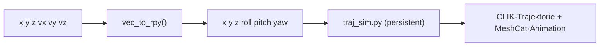

# Greifer-Vektor -> RPY -> Trajektorien-Simulation

Zwei Skripte in `example/sim/`, mit denen sich eine Zielpose ueber Position +
Greifer-Richtungsvektor (`x y z vx vy vz`) statt direkt ueber `roll pitch yaw`
angeben laesst, und die das Ergebnis live in MeshCat simulieren.

## Hintergrund

`vx vy vz` ist die gewuenschte Zeigerichtung des Greifers -- das entspricht der
lokalen X-Achse des Endeffektor-Frames (siehe `live_pose_plot.py`,
`kinematics-model-facts`). Eine reine Richtung legt aber den Rollwinkel um die
eigene Achse nicht fest -- deshalb wird `roll=0` angenommen, dieselbe
Konvention wie bei `direction_roll_to_matrix()`/`direction_to_rot()`
(`vec_pose_sim.py`, `poses_sim.py`).

## `vec_to_rpy.py` -- reine Umrechnung

Wandelt `x y z vx vy vz` in `x y z roll pitch yaw` um (roll/pitch/yaw in
Radiant), ohne IK oder Visualisierung.

```bash
cd ~/reBotArm_control_py
uv run python example/sim/vec_to_rpy.py 0.2 -0.36 0.17 0.00 -0.701 -0.701
# x=0.200000 y=-0.360000 z=0.170000 roll=0.000000 pitch=0.785398 yaw=-1.570796
```

Ohne Argumente startet es interaktiv (eine Zeile `x y z vx vy vz` pro Pose,
`q`/`quit`/`exit` zum Beenden).

## `vec_traj_sim.py` -- Umrechnung + Trajektorien-Simulation

Ruft `vec_to_rpy.vec_to_rpy()` auf und uebergibt das Ergebnis direkt an ein
einmalig gestartetes `traj_sim.py`, das die Trajektorie plant, per CLIK
abfaehrt und in MeshCat abspielt. Gibt nach jedem Schritt eine Statuszeile aus.

```bash
cd ~/reBotArm_control_py
uv run python example/sim/vec_traj_sim.py 0.2 -0.36 0.17 0.00 -0.701 -0.701
```

**Wichtig:** `traj_sim.py` wird dabei **einmal dauerhaft gestartet** und laeuft
nach der ersten Pose **weiter** -- es wird kein automatisches `q` gesendet.
Danach koennen im selben Terminal weitere Posen als `x y z vx vy vz` eingegeben
werden; sie werden ebenfalls ueber `vec_to_rpy()` umgerechnet und an den
laufenden `traj_sim.py`-Prozess weitergereicht. Erst `q`/`quit`/`exit` beendet
sowohl die Eingabeschleife als auch `traj_sim.py`.

Ohne Kommandozeilen-Argumente startet `vec_traj_sim.py` direkt interaktiv
(erste Pose wird ueber den `> `-Prompt abgefragt).

**Hinweis:** Da das Skript interaktiv auf weitere Eingaben wartet und ein
MeshCat-Browserfenster oeffnet, sollte es direkt in einem echten Terminal
gestartet werden (nicht in einer nicht-interaktiven/automatisierten Shell).

## Ablauf


